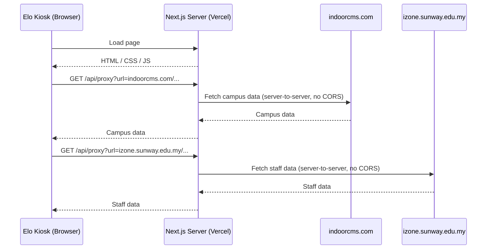
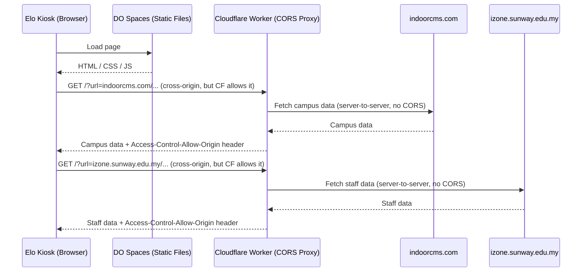
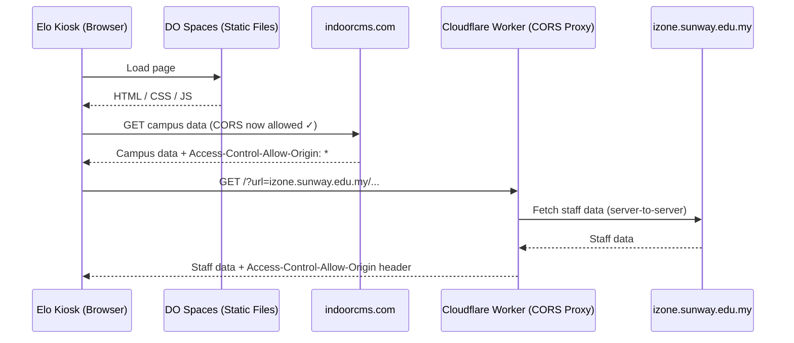
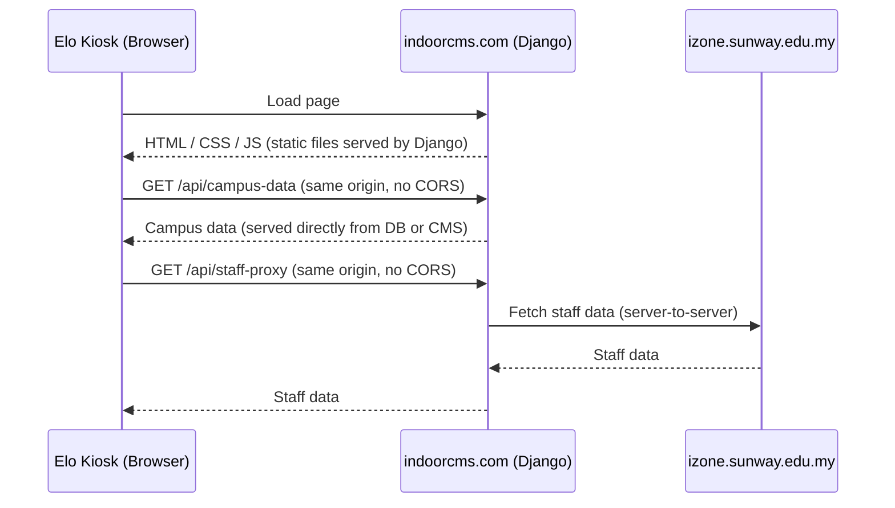
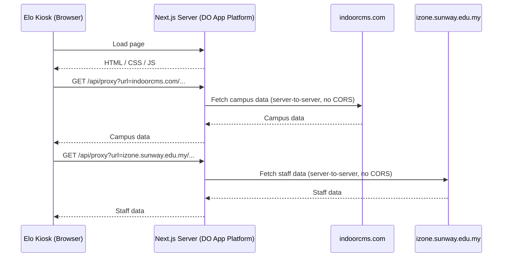

# Data Flow Diagrams

## 1. Previous Setup (Vercel / Next.js server)

The browser never talked to external APIs directly.
The Next.js server acted as the middle man for everything.

---

## 2. Current Setup (DO Spaces + Cloudflare Worker)

The app is now static files — no Next.js server. The browser fetches APIs directly, but needs a relay for CORS.

---

## 3. Option A — Enable CORS on indoorcms.com (recommended quick win)

Add `Access-Control-Allow-Origin: *` to the CMS API responses.
The browser can fetch campus data directly. Staff data still needs a relay.

---

## 4. Option B — Host on indoorcms.com (Django)

The kiosk app is served from the same origin as the CMS.
No CORS issues for campus data. Staff data proxied by Django.

---

## 5. Option C — Next.js server on DO App Platform

Back to a server, but hosted on DigitalOcean instead of Vercel.
Same pattern as the original Vercel setup, everything in one place.

---

## Summary

| Setup | Hosting | Campus Data | Staff Data | Extra Services |
|---|---|---|---|---|
| Previous (Vercel) | Vercel (server) | Proxied via Next.js | Proxied via Next.js | None |
| Current (DO Spaces) | DO Spaces (static) | Cloudflare Worker | Cloudflare Worker | Cloudflare |
| Option A (CORS fix) | DO Spaces (static) | Direct fetch | Cloudflare Worker | Cloudflare (staff only) |
| Option B (Django) | indoorcms.com | Same origin | Proxied via Django | None |
| Option C (DO App) | DO App Platform (server) | Proxied via Next.js | Proxied via Next.js | None |
